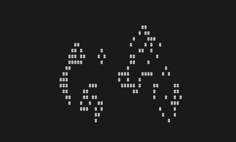

life
====

a simple command line implementation of conway's game of life with ncurses

some command line options:

    -w Turn off edge wrapping
    -h Show this help message
    -s [seed] Seed randomization with given number
    -c [char] Represent live cells with the given character
    -r [rate] Update the game [rate] times per second (0 for no delay)

some commands inside the program:

    p - Pause/play the "game"
    t/Space - toggle the state of the cell under the cursor
    h/j/k/l - move cursor vi - style
    c - clear the board
    r - randomize the board
    s - save the board state
    u - undo to saved board state (initial state is auto saved at start)
